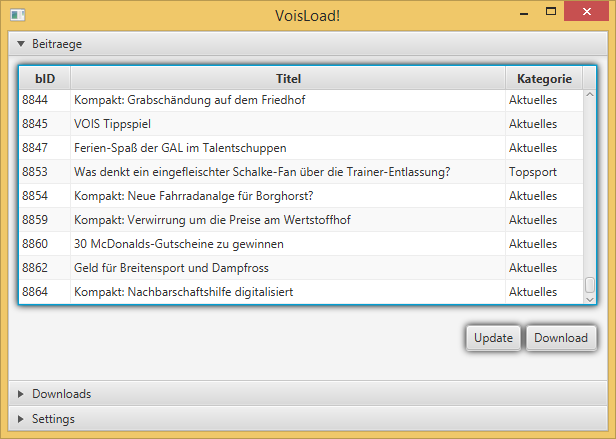
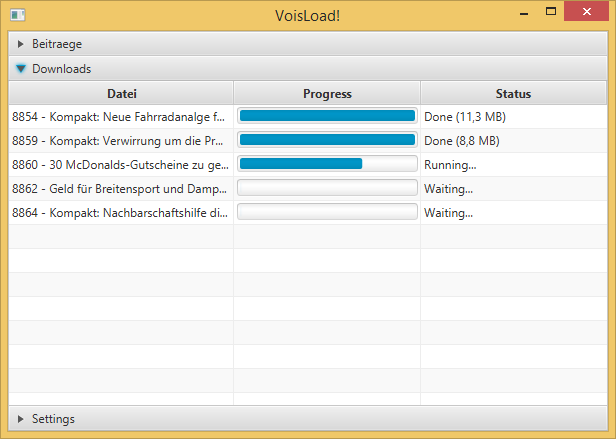

VoisLoad!
=========
Ein Downloadtool für den Sender Vor Ort in Steinfurt
----------------------------------------------------
*Das hier angebotene Programm ist nur für Forschungs- und Lernzwecke erstellt worden und sollte auch nur dazu verwendet werden. Besucht bitte auch weiterhin die Seite des Senders um Werbeeinnahmen zu generieren!*

## Überblick ##
Das Programm VoisLoad! bietet die Möglichkeit Beiträge des Senders "Vor Ort in Steinfurt" im h264-Format herunterzuladen.
Der Workflow ist sehr einfach, komfortabel und quasi selbsterklärend.

Screenshot der Beitragsliste.

Hier können die verfügbaren Beiträge angesehen und die Liste aktualisiert kann aktualisiert werden. Die Update-Funktion hat folgende Besonderheit:

> Die Beiträge sind nicht komplett aufsteigend durchnummeriert sondern es sind immer wieder "Lücken" mit verschiedenen Größen vorhanden. Default werden maximal 5 nicht vorhandene Beiträge übersprungen. Um auch größere Lücken überpringen zu können wird der Wert zur Laufzeit mit jedem Klick auf Update verdoppelt (Bsp. *5, 10, 20, 40...*). Ein Neustart resetet die Laufweite wieder auf 5.

Markierte Beiträge werden mit einem Klick auf "Download" in die Warteschlange übernommen und es wird zum Downloadbereich gewechselt.

Screenshot der Downloadübersicht

##Anwendungsfall##
Haupteinsatzfall der Software und Ursprung der Idee ist eine Kombination mit einem UPNP-Server. Wenn als Downloadordner ein Share des UPNP-Server angegeben wird können die Beiträge komfortabel auf einem nicht flashfähigen Smart-TV angesehen werden.

----------
##Technik##
Das Programm nutzt Java8 und das darin enthaltene javaFx-Framework für die grafische Oberfläche.
Für die Kommunikation mit der Webseite wird [HttpComponents von Apache](http://hc.apache.org/ "HttpComponents von Apache") genutzt. Um komfortabler mit JSON umzugehen wird die Java-Library von json.org genutzt.

Die GUI ist frei skalierbar und bleibt auch in extremen Auflösungen (3840x1080) benutzbar. Die jeweiligen Jobs zum Updaten der Liste oder Downloaden der Beiträge laufen asynchron im Hintergrund damit die GUI immer benutzbar bleibt.

Um die Informationen zu sammeln werden die HTML-Ausgaben anaylisiert. Dies ist nicht sehr robust, in diesem Fall aber die einzige Möglichkeit an die Daten zu kommen. Bei älteren Beiträgen wird dem Flash-Player ein JSON-Objekt übergeben, dieses kann ausgelesen und dann selbst verwendet werden. Neuere Beiträge nutzen diese Technik nicht mehr, hier wird der Seitentitel genutzt um die Informationen auszulesen.
